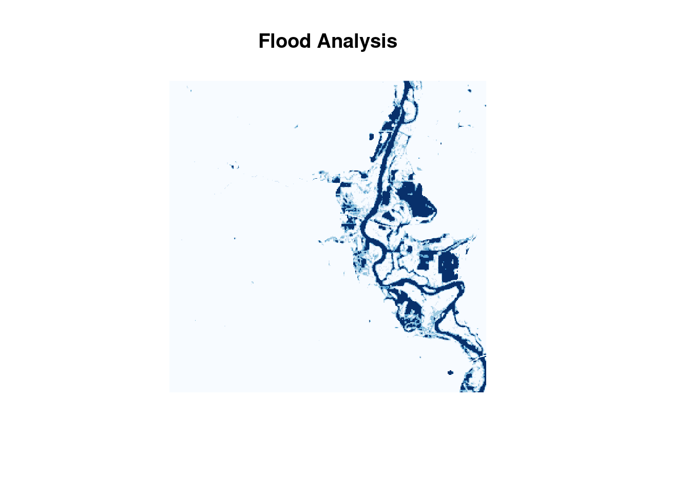
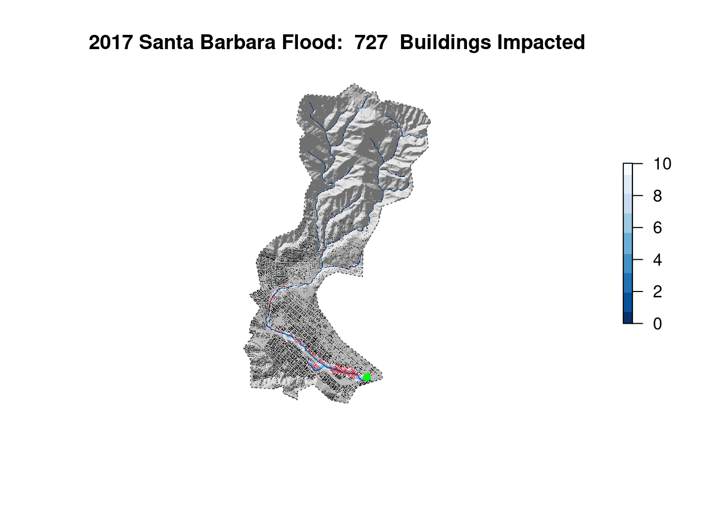

## GEOG 176A

In the summer of 2020 I took a class GIS course based in R. I wrote some code, and did some cool data science. Here is a collection of links! 

<h5 class="card-title"><i class="fas fa-chart-bar"></i> Tracking COVID-19 Data</h5>
<ul class="list-group list-group-flush">
<li class="list-group-item">Parsed real-world data using <b>tidyverse</b> functions and plotted using <b>ggplot2</b>.</li>
<li class="list-group-item">Used statistical methods for analyzing confirmed COVID-19 cases.</li>
<li class="list-group-item">Analyzed COVID-19's weighted mean center travel across the United States.</li>
</ul>

<a href="https://gis.justinsingh.me/labs/lab-02" class="btn btn-primary btn-lg">Lab 2</a>

<h5 class="card-title"><i class="fas fa-globe-americas"></i> Analyzing Spatial Data in the US</h5>
<ul class="list-group list-group-flush">
<li class="list-group-item">Gathered spatial data about US cities and their relation to national borders using <b>tidyverse</b> and <b>sf</b> libraries.</li>
<li class="list-group-item">Used <b>gghighlight</b> and <b>ggplot2</b> to visualize spatial data, and <b>sf</b> to calculate distances.</li>
<li class="list-group-item">Analyzed controversial Federal Agencies' claims based on an <a href="https://www.aclu.org/other/constitution-100-mile-border-zone">ACLU article</a> to verify statistics given.</li>
</ul>

<a href="https://gis.justinsingh.me/labs/lab-03" class="btn btn-primary btn-lg">Lab 3</a>

<h5 class="card-title"><i class="fas fa-cubes"></i> Point-in-Polygon Analysis with Tessellations</h5>
<ul class="list-group list-group-flush">
<li class="list-group-item">Generated and analyzed <b>tessellated spatial datasets</b>, such as: <em>square</em> and <em>hexagonal coverages</em>, <em>Voronoi tessellations</em>, and <em>Delaunay triangulation</em>.</li>
<li class="list-group-item">Performed <b>point-in-polygon</b> analysis using US Dams dataset from US Army Corps of Engineers.</li>
<li class="list-group-item">Created a <b>leaflet</b> interactive map to analyze dams at risk for floods along the Mississippi river system.</li>
</ul>

<a href="https://gis.justinsingh.me/labs/lab-04" class="btn btn-primary btn-lg">Lab 4</a>

<h5 class="card-title"><i class="fas fa-object-group"></i> Flood Analysis using Remote Sensing</h5>
<ul class="list-group list-group-flush">
<li class="list-group-item">Using <b>Landsat Data</b> generated <b>rasters</b> and computed band combinations for surface water features.</li>
<li class="list-group-item">Utilized statistical methods, namely <b>k-means clustering</b> to highlight potential flood areas.</li>
<li class="list-group-item">Applied flood data to visually identify at-risk areas using <b>leaflet/mapview</b></li>
</ul>

<a href="https://gis.justinsingh.me/labs/lab-05" class="btn btn-primary btn-lg">Lab 5</a>

<h5 class="card-title"><i class="fas fa-exclamation-triangle"></i> Flood Risk in Mission Creek: Past, Present, Future</h5>
<ul class="list-group list-group-flush">
<li class="list-group-item">Pulled data from the <em>USGS</em> and <em>OpenStreetMap</em> to assess the <b>flood risk</b> of buildings near a river system.</li>
<li class="list-group-item">Used <b>whitebox</b> to create a <b>Height Above Nearest Drainage</b> raster for a specific <b>AOI</b>.</li>
<li class="list-group-item">Created a <b>Flood Inudation Map Library</b> to observe flood impact on surrounding buildings.</li>
</ul>

<a href="https://gis.justinsingh.me/labs/lab-06" class="btn btn-primary btn-lg">Lab 6</a>

