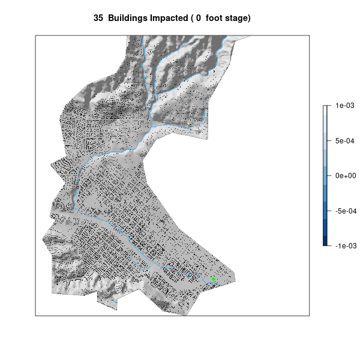

```{r setup, include = FALSE}
library(tidyverse)
library(sf)        # vector manipulation
library(raster)    # raster manipulation
library(fasterize) # "faster" raster
library(whitebox)  # terrain analysis

# Data libraries
library(osmdata)   # OSM API
library(elevatr)   # Elevation  Web Tiles

knitr::opts_chunk$set(
    warning = FALSE,
    message = FALSE,
    out.width = "75%",
    fig.align = "center"
)
```

# Collecting Data

We begin this lab by collecting data from two sources: the USGS, and OpenStreetMap. Here we see the AOI, and corresponding data that we will use.

```{r}
# Getting Basin Boundary
waterdata <- "https://labs.waterdata.usgs.gov/api/nldi/linked-data/nwissite/USGS-11119750/basin"
basin_boundary <- sf::read_sf(waterdata)
basin_boundary_elev <- elevatr::get_elev_raster(basin_boundary, z = 13) %>%
    raster::crop(basin_boundary) %>%
    raster::mask(basin_boundary)

basin_boundary_elev <- basin_boundary_elev * 3.281 # convert `m` to `ft`

# Comment when file is already written
# raster::writeRaster(basin_boundary_elev, "data/basin-boundary-elev.tif", overwrite = TRUE)

bb <- st_bbox(basin_boundary) %>%
    st_as_sfc() %>%
    st_transform(4326)

# OSM Data
basin_buildings <- osmdata::opq(bb) %>%
    add_osm_feature(key = "building") %>%
    osmdata_sf()

basin_buildings <- basin_buildings$osm_polygons %>%
    sf::st_centroid() %>%
    st_intersection(basin_boundary)

# Plot to test if clipping worked as intended
# plot(basin_boundary)
# plot(basin_buildings, max.plot=1, add = TRUE)

basin_railway <- dplyr::filter(basin_buildings, amenity == "railway")

basin_streams <- osmdata::opq(bb) %>%
    add_osm_feature(key = "waterway", value = "stream") %>%
    osmdata_sf()

basin_streams <- basin_streams$osm_lines %>%
    st_intersection(basin_boundary)

# Plot to test if clipping worked as intended
# plot(basin_boundary)
# plot(basin_streams, max.plot=1, add = TRUE)
```
## {.tabset .tabset-pills .tabset-fade .toc-ignore}
```{r, results = 'asis', echo = FALSE}
cat("\n\n")
cat("### Basin Boundary")
cat("\n\n")
plot(basin_boundary, axes = FALSE, main = "USGS-11119750")
cat("\n\n")
cat("### Basin Buildings")
cat("\n\n")
plot.new()
plot(
    basin_boundary,
    axes = FALSE,
    main = "OSM: building=*"
)
plot(
    basin_buildings,
    axes = FALSE,
    max.plot = 1,
    add = TRUE
)
cat("\n\n")
cat("### Basin Streams")
cat("\n\n")
plot.new()
plot(
    basin_boundary,
    axes = FALSE,
    main = "OSM: waterway=stream"
)
plot(
    basin_streams,
    axes = FALSE,
    max.plot = 1,
    add = TRUE
)
cat("\n\n")
```

# Terrain Analysis

We first want to vizualize the data that we will be performing on. Here we have the basin's hillshade, with the river system we are interested in overlayed on top:

```{r}
# whitebox::wbt_hillshade("data/basin-boundary-elev.tif", "data/basin-elev-hillshade.tif")

basin_hillshade <- raster::raster("data/basin-elev-hillshade.tif")

# Plot hillshade (background)
plot(
    basin_hillshade,
    axes = FALSE,
    box = FALSE,
    col = gray.colors(256, alpha = 0.2),
    legend = FALSE,
    main = "Basin and Streams"
)
# Plot hillshade (mask)
plot(
    mask(basin_hillshade, basin_boundary),
    col = gray.colors(256, alpha = .8),
    legend = FALSE,
    add = TRUE
)
# Plot basin boundary
plot(
    basin_boundary,
    lty = 3,
    border = "#575757",
    add = TRUE
)
# Plot streams
plot(
    basin_streams,
    max.plot = 1,
    lwd = 2,
    col = "#4852da",
    add = TRUE
)

```

Using this, the goal is to create a **Height Above Nearest Drainage** raster, to observe flooding. To do this, we use the `whitebox` package
We also need to take into account the local reference datum, which our raster does not initially.
To achieve this, we offset the raster by a certain value retrieved from the USGS for the area.
After correcting, this gives us the offset *HAND* raster:

```{r}
# Buffer streams by 10m
buffered_streams <- basin_streams %>%
    st_transform(5070) %>%
    st_buffer(dist = 10) %>%
    st_transform(4326)

# Get HAND raster
streams_raster <- fasterize::fasterize(buffered_streams, basin_boundary_elev)
raster::writeRaster(streams_raster, "data/streams.tif", overwrite = TRUE)
# whitebox::wbt_breach_depressions("data/basin-boundary-elev.tif", "data/elev-wbt.tif")
# whitebox::wbt_elevation_above_stream("data/elev-wbt.tif", "data/streams.tif", "data/elev-above-streams.tif")

# Correct HAND raster by USGS offset
hand_raster <- raster::raster("data/elev-above-streams.tif")
river_raster <- raster::raster("data/streams.tif")
hand_raster_offset <- hand_raster + 3.69

# Fix values in HAND raster
values_with_1 <- which(values(river_raster) == 1)
values(hand_raster_offset)[values_with_1] <- 0
raster::writeRaster(hand_raster_offset, "data/hand_raster_offset.tif", overwrite = TRUE)


plot(
    hand_raster_offset,
    col = rev(blues9),
    box = FALSE,
    axes = FALSE,
    main = "Offset HAND Raster"
)
```

Note that, while we have this *HAND* raster, it displays all flood stages at once. As a result, we need to perform some
calculations in order to get the exact flood stage that we want to analyze.

# 2017 Impact Assessment

Based on a USGS historal peak chart, on February 17th 2017, the river the largest observed record of reaching a stage of 10.02 feet.
The following plot depicts this flood map:

```{r}
# flood threshold
hand_raster_offset <- raster::raster("data/hand_raster_offset.tif")
threshold <- function(x) {return(ifelse(x > 10.02, NA, x))}
flood_raster <- calc(hand_raster_offset, threshold)

# Plot hillshade (mask)
plot(
    mask(basin_hillshade, basin_boundary),
    col = gray.colors(256, alpha = .8),
    legend = FALSE,
    axes = FALSE,
    box = FALSE,
    main = "Basin with Flood Streams"
)
# Plot floods
plot(
    flood_raster,
    col = rev(blues9),
    add = TRUE
)
# Plot basin boundary
plot(
    basin_boundary,
    lty = 3,
    border = "#575757",
    add = TRUE
)
# Plot railway
plot(
    basin_railway,
    col = "green",
    cex = 1,
    pch = 16,
    add = TRUE
)

```
The plot seems relatively accurate to the zoom level we have. The railway seems to be well within the flood zone.

Now, we want to observe the impact on the buildings within our AOI based on this flood. With this in mind, we get the following
plot describing the impact:

```{r}
# Get impacted buildings and count
building_impact <- raster::extract(flood_raster, basin_buildings)
num_buildings_impacted <- sum(!is.na(building_impact))
basin_buildings$impact <- building_impact

# Plot hillshade
plot(
    mask(basin_hillshade, basin_boundary),
    col = gray.colors(256, alpha = .8),
    legend = FALSE,
    axes = FALSE,
    box = FALSE,
    main = paste("2017 Santa Barbara Flood: ", num_buildings_impacted, " Buildings Impacted")
)
# Plot floods
plot(
    flood_raster,
    col = rev(blues9),
    add = TRUE,
    legend = FALSE
)
# Plot basin boundary
plot(
    basin_boundary,
    lty = 3,
    border = "#575757",
    add = TRUE
)
# Impacted Buildings
plot(
    basin_buildings,
    col = ifelse(is.na(basin_buildings$impact), "black", "red"),
    cex = .08,
    pch = 16,
    add = TRUE
)
# Plot railway
plot(
    basin_railway,
    col = "green",
    cex = 1,
    pch = 16,
    add = TRUE
)
```

As we can notice, `r num_buildings_impacted` buildings were impacted as a result of this flood. 

# Flood Inudation Map library

Continuining in the same fashion as describing the impact in 2017, we will create a **Flood Inudation Map Library** for Mission Creek.
The following FIM library visualizes the impact on buildings from the stage values of 0 to 20 feet:


<center>

</center>

Notice that, since the river system raster has a buffer of 10 meters,
we have that there are cases of false inudation at stage 0.
This occurs, despite that the river system may not be that wide.
 
```{r, include = FALSE, eval = FALSE}
sb <- AOI::aoi_get("Santa Barbara")

flood_raster_sb <- hand_raster_offset %>%
    crop(sb) %>%
    mask(sb)

basin_hillshade_sb <- basin_hillshade %>%
    crop(sb) %>%
    mask(sb)

buildings_sb <- st_intersection(basin_boundary, basin_buildings)

gifski::save_gif({
  for(i in 0:20) {
        flood <- flood_raster_sb
        values(flood)[which(values(flood) > i)] <- NA

        impact_sb <- raster::extract(flood, buildings_sb)
        impacted_num_sb <- sum(!is.na(impact_sb))
        buildings_sb$impact <- impact_sb

        # Plot hillshade
        plot(
            mask(basin_hillshade_sb, basin_boundary),
            col = gray.colors(256, alpha = .8),
            legend = FALSE,
            axes = FALSE,
            main = paste(impacted_num_sb, " Buildings Impacted (", i, " foot stage)")
        )
        # Plot floods
        plot(
            flood,
            col = rev(blues9),
            add = TRUE
        )
        # Plot basin boundary
        plot(
            basin_boundary,
            lty = 3,
            border = "#575757",
            add = TRUE
        )
        # Impacted Buildings
        plot(
            buildings_sb,
            col = ifelse(is.na(buildings_sb$impact), "black", "red"),
            cex = .08,
            pch = 16,
            add = TRUE
        )
        # Plot railway
        plot(
            basin_railway,
            col = "green",
            cex = 1,
            pch = 16,
            add = TRUE
        )
  }
}, gif_file = "labs/data/mission-creek-fim.gif",
   width = 600, height = 600,
   delay = .7, loop = TRUE)
```